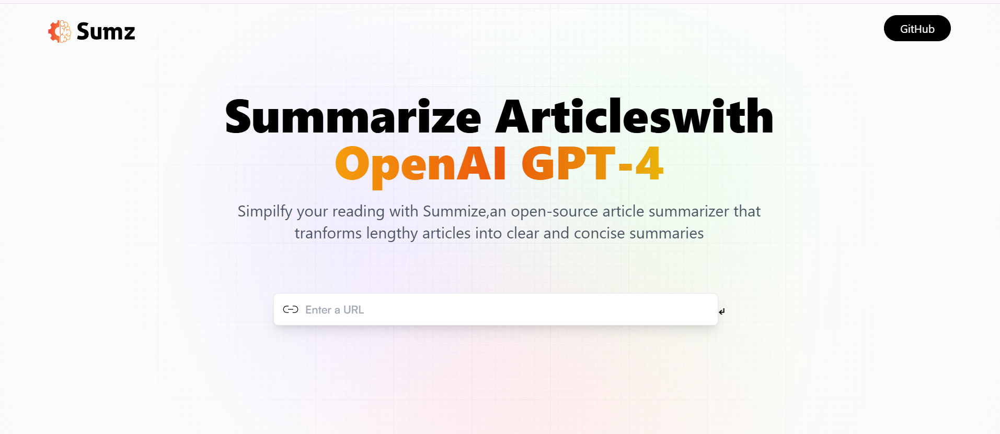

# 📰 AI Article Summarizer

A modern AI-powered web application that summarizes any article using OpenAI's NLP capabilities. Built with **React**, **Vite**, and **Tailwind CSS**, and deployed live on **Netlify**.

🔗 **Live Demo**: [articlesummarizer-ai.netlify.app](https://articlesummarizer-ai.netlify.app/)  
📁 **Repository**: [GitHub - mahak-shar/AI-ArticleSummarizer](https://github.com/mahak-shar/AI-ArticleSummarizer)

---

## 📸 Preview

---

## 🚀 Features

- ✨ Summarizes any article using AI (OpenAI API)
- 🔗 Input any article URL
- 📄 View summaries in a clean, minimalist UI
- 💾 Automatically stores your summary history
- ⚡ Super-fast build with Vite
- 💅 Styled with Tailwind CSS

---

## 🛠 Tech Stack

- **Frontend**: React + Vite
- **Styling**: Tailwind CSS
- **API**: OpenAI (via RapidAPI or direct API key)
- **Deployment**: Netlify

---

## 🧠 How It Works

1. User enters a URL.
2. The app sends a request to the OpenAI API with the article content.
3. The summarized output is shown on the screen.
4. Summarized articles are stored locally in browser storage.

---

## 🧪 Installation & Setup

1. **Clone the repo**  
   `git clone https://github.com/mahak-shar/AI-ArticleSummarizer.git`

2. **Install dependencies**  
   `npm install`

3. **Add your OpenAI API key**  
   Create a `.env` file in the root and add:

4. **Run locally**  
`npm run dev`

---

## 🌐 Deployment

The project is deployed on [Netlify](https://netlify.app).  
You can deploy your own version by:

1. Connecting your GitHub repo to Netlify
2. Setting `VITE_RAPID_API_KEY` in Netlify environment variables
3. Triggering a build

---

## 🙋‍♀️ Author

**Mahak Sharma**  
GitHub: [@mahak-shar](https://github.com/mahak-shar)  
Portfolio: [Coming Soon]

---

## 📄 License

This project is open-source and available under the [MIT License](LICENSE).

---

⭐️ If you found this helpful, feel free to star the repository!

